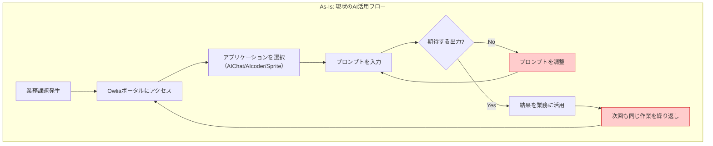
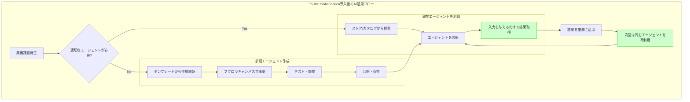
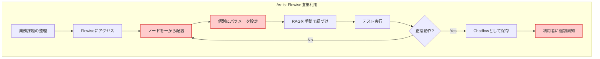
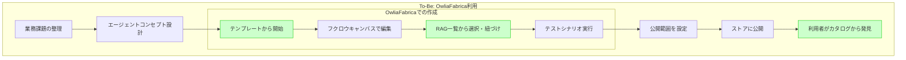
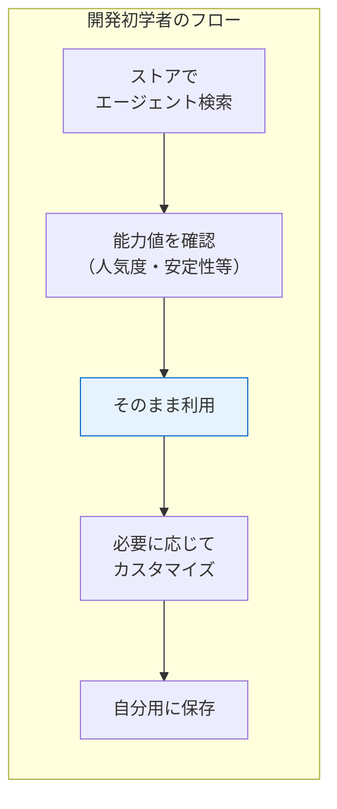
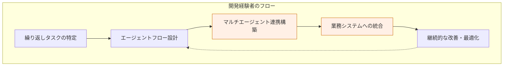
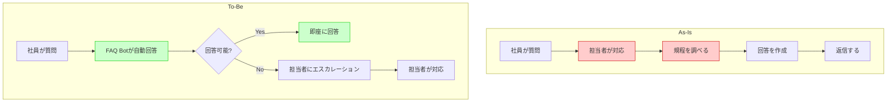
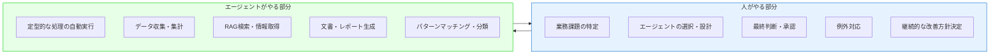

# OwliaFabrica 業務フロー（As-Is / To-Be）

## 1. 全体業務フロー

### 1.1 As-Is（現状）

現状のAI活用では、ユーザーがポータルに都度アクセスし、プロンプトを試行錯誤しながら調整する必要がある。

**問題点:**
- 毎回ポータルにアクセスする操作負荷
- プロンプトの往復回数が多い
- 同じ業務でも毎回一から入力・調整
- AI活用が特定シーンに限定

---

### 1.2 To-Be（OwliaFabrica導入後）

OwliaFabricaでは、エージェントを一度作成すれば再利用可能。業務アプリに組み込んでシームレスに活用。

**改善点:**
- プロンプトの往復なしで高品質な出力
- 再利用可能なエージェントで効率化
- 業務アプリにシームレスに組み込み

---

## 2. エージェント作成フロー

### 2.1 As-Is（Flowise直接利用※MateChat）

**問題点:**
- ノード構成を一から設計する必要がある
- パラメータ設定が複雑
- 利用者への周知が属人的
- 再利用・共有の仕組みがない

---

### 2.2 To-Be（OwliaFabrica利用）

**改善点:**
- テンプレートから簡単に開始
- 抽象ノードで設定を簡素化
- カタログで自動的に発見可能

---

## 3. ユーザー種別フロー

### 3.1 開発初学者（ストア利用）

| ステップ | 人がやること | エージェントがやること |
|---------|------------|---------------------|
| 検索 | キーワード・タグで絞り込み | 関連エージェントを表示 |
| 確認 | 能力値・説明を確認 | 統計情報を自動計算 |
| 利用 | 入力を与える | 処理を実行、結果を出力 |
| カスタマイズ | ノード設定を調整 | フローを実行 |
| 保存 | 名前・説明を入力 | Flowiseに同期 |

---

### 3.2 開発経験者（高度な構築）

| ステップ | 人がやること | エージェントがやること |
|---------|------------|---------------------|
| タスク特定 | 自動化対象を選定 | - |
| フロー設計 | ノードを配置・接続 | テンプレートを提案 |
| マルチ連携 | 複数エージェントを接続 | 依存関係を自動解析 |
| システム統合 | API連携を設定 | 定期実行・通知 |
| 改善 | 統計を確認、調整 | パフォーマンスを計測 |

---

## 4. 業務フロー別 変更ポイント

### 4.1 社内問い合わせ対応

| 工程 | As-Is（人） | To-Be（人） | To-Be（エージェント） |
|-----|------------|------------|---------------------|
| 質問受付 | 担当者が確認 | - | 自動受付 |
| 情報検索 | 担当者が規程を調査 | - | RAGで自動検索 |
| 回答作成 | 担当者が文面作成 | 複雑な案件のみ | LLMで自動生成 |
| 返信 | 担当者が送信 | エスカレーション対応のみ | 自動返信 |

---

### 4.2 進捗報告書作成

```mermaid
flowchart TB
    subgraph AsIsReport["As-Is"]
        I1["Backlogからデータ抽出"] --> I2["Excelに転記"]
        I2 --> I3["グラフ作成"]
        I3 --> I4["コメント記入"]
        I4 --> I5["報告書完成"]
    end

    subgraph ToBeReport["To-Be"]
        J1["報告書生成を指示"] --> J2["データ自動取得"]
        J2 --> J3["分析・グラフ生成"]
        J3 --> J4["コメント自動生成"]
        J4 --> J5["PMが確認・調整"]
        J5 --> J6["報告書完成"]
    end

    style I1 fill:#ffcccc,stroke:#cc0000
    style I2 fill:#ffcccc,stroke:#cc0000
    style I3 fill:#ffcccc,stroke:#cc0000
    style J2 fill:#ccffcc,stroke:#00cc00
    style J3 fill:#ccffcc,stroke:#00cc00
    style J4 fill:#ccffcc,stroke:#00cc00
```

| 工程 | As-Is（人） | To-Be（人） | To-Be（エージェント） |
|-----|------------|------------|---------------------|
| データ抽出 | 手動でBacklog確認 | - | API連携で自動取得 |
| 転記・集計 | Excelに手入力 | - | 自動集計 |
| グラフ作成 | 手動で作成 | - | 自動生成 |
| コメント | 増減理由を分析・記入 | 最終確認のみ | 前月比分析で自動生成 |

---

### 4.3 コードレビュー

```mermaid
flowchart TB
    subgraph AsIsReview["As-Is"]
        K1["PRを作成"] --> K2["レビュアーに依頼"]
        K2 --> K3["レビュアーが全コード確認"]
        K3 --> K4["指摘・修正"]
        K4 --> K5["再レビュー"]
    end

    subgraph ToBeReview["To-Be"]
        L1["PRを作成"] --> L2["自動セルフレビュー"]
        L2 --> L3["セキュリティチェック"]
        L3 --> L4["PR説明文自動生成"]
        L4 --> L5["レビュアーに依頼"]
        L5 --> L6["レビュアーが確認"]
        L6 --> L7["最終確認・マージ"]
    end

    style K3 fill:#ffcccc,stroke:#cc0000
    style L2 fill:#ccffcc,stroke:#00cc00
    style L3 fill:#ccffcc,stroke:#00cc00
    style L4 fill:#ccffcc,stroke:#00cc00
```

| 工程 | As-Is（人） | To-Be（人） | To-Be（エージェント） |
|-----|------------|------------|---------------------|
| PR作成 | 全て手動 | コード変更のみ | 説明文自動生成 |
| セルフチェック | 手動で確認 | 結果の確認 | 自動レビュー実行 |
| セキュリティ | 見落としリスク | 結果の確認 | 脆弱性自動検出 |
| レビュー依頼 | 説明文を手書き | 確認のみ | 確認ポイント自動提示 |
| 本レビュー | 全コード確認 | 重要箇所に集中 | 事前にリスク箇所特定 |

---

## 5. まとめ：人とエージェントの役割分担

### 役割分担の原則

| 区分 | 人がやる | エージェントがやる |
|------|---------|------------------|
| **判断** | 最終意思決定、例外対応、方針決定 | パターンに基づく分類・推奨 |
| **創造** | 新規企画、戦略立案 | 素案生成、情報整理 |
| **確認** | 品質チェック、承認 | 自動チェック、リスク検出 |
| **実行** | 対人コミュニケーション | 定型処理、データ処理 |
| **管理** | 優先度判断、リソース配分 | 進捗追跡、アラート |
