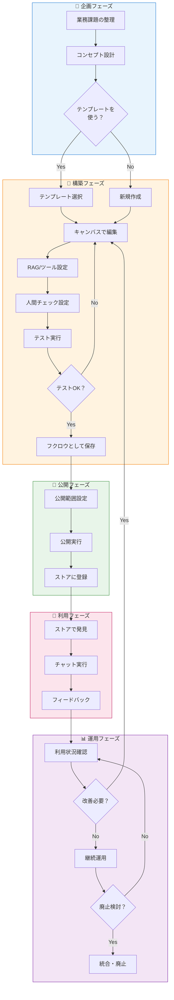
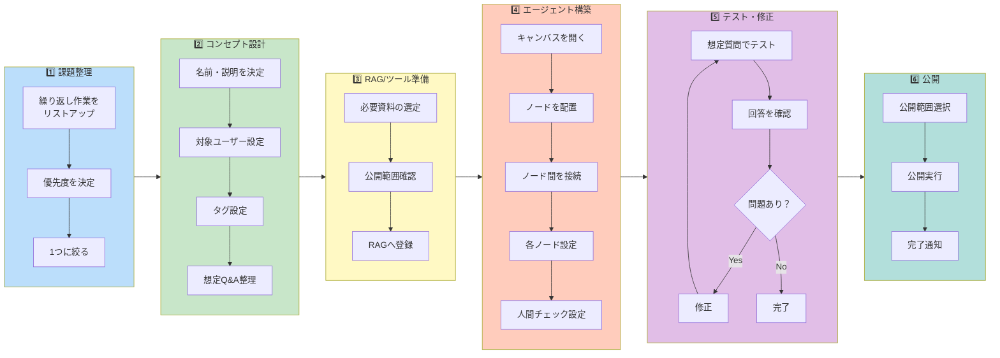
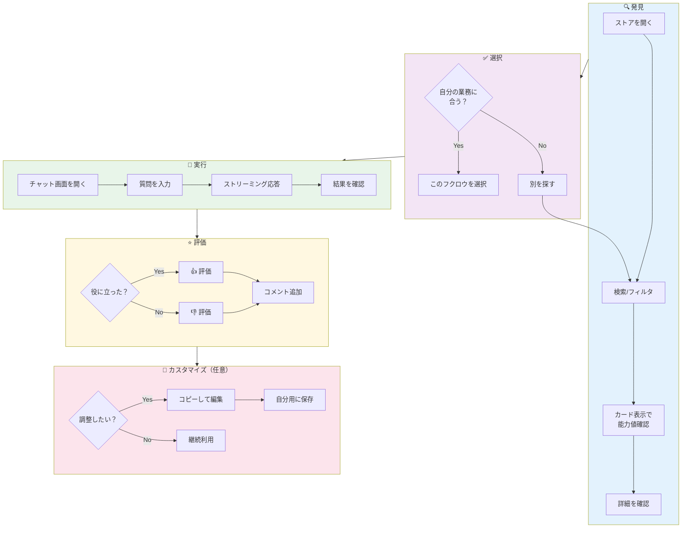
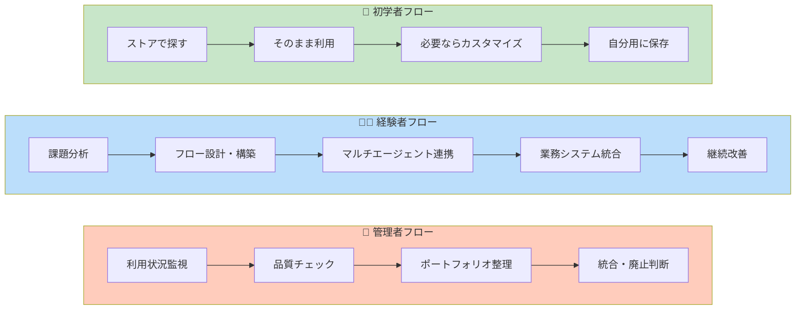

# OwliaFabrica 機能一覧（業務フロー × 機能マトリクス）

## 0. ユーザー目線の業務フロー図

### 0.1 全体フロー（エージェント作成〜利用）



### 0.2 エージェント作成者の詳細フロー



### 0.3 エージェント利用者のフロー



### 0.4 ペルソナ別フロー比較



---

## 1. 機能一覧サマリー

### 1.1 MVPスコープ

| 区分 | MVP機能数 | Phase 2以降 |
|------|----------|-------------|
| エージェント作成者向け | 27機能 | 14機能 |
| エージェント利用者向け | 10機能 | 7機能 |
| 管理者・運営向け | 3機能 | 7機能 |
| RAG・ナレッジ基盤 | 2機能 | 2機能 |
| 共通・インフラ | 2機能 | 2機能 |
| **合計** | **44機能** | **32機能** |

---

## 2. 業務フロー × 機能マトリクス

### 2.1 エージェント作成フロー

| 業務フロー | 機能# | 機能名 | 概要 | MVP |
|----------|-------|--------|------|-----|
| **[1] 業務課題整理** | C-A1 | 業務課題カタログ | 繰り返し作業・FAQ・調査業務を記入するフォーム | - |
| | C-A2 | 自動優先度スコア | 頻度×負荷×影響範囲で優先度を計算 | - |
| **[2] コンセプト設計** | C-1 | 基本情報入力 | フクロウの名前・一行説明・詳細説明 | ✅ |
| | C-2 | 対象ユーザー設定 | 自分/チーム/部署/全社 | ✅ |
| | C-3 | タグ設定 | カテゴリタグの選択・追加 | ✅ |
| | C-4 | アイコン設定 | フクロウのアイコン選択 | - |
| | C-5 | フクロウテンプレート一覧 | 用途別テンプレート表示 | ✅ |
| | C-6 | テンプレートから作成 | テンプレートを選んで作成開始 | ✅ |
| | C-7 | テンプレートプレビュー | 内部ノード構成を事前確認 | - |
| **[3] RAG/ツール準備** | C-31 | RAG一覧表示 | 利用可能なRAGを表示 | ✅ |
| | C-32 | RAG選択・紐づけ | RAGノードにコレクションを紐づけ | ✅ |
| | C-33 | RAG新規作成 | Fabricaから新規RAG作成 | - |
| | C-34 | RAGファイルアップロード | 資料をアップロードしてRAG化 | - |
| **[4] エージェント構築** | C-8 | フクロウキャンバス表示 | 統一キャンバスの表示 | ✅ |
| | C-9 | フクロウ新規作成 | 新しいフクロウを配置 | ✅ |
| | C-10 | 既存フクロウ配置 | 保存済みフクロウを配置 | ✅ |
| | C-11 | フクロウ間接続 | マルチフクロウ構成 | ✅ |
| | C-12 | キャンバス保存 | キャンバス全体を保存 | ✅ |
| | C-13 | キャンバス読み込み | 保存済みキャンバスを編集 | ✅ |
| | C-14 | 内部編集モード切替 | ダブルクリックでノード編集モードへ | ✅ |
| | C-15 | ノード追加 | 抽象ノードを追加 | ✅ |
| | C-16 | ノード間接続 | ノード同士を接続 | ✅ |
| | C-17 | ノード設定パネル | 実装選択とパラメータ設定 | ✅ |
| | C-18 | フクロウ保存 | Flowise形式で保存 | ✅ |
| | C-19 | 編集モード終了 | キャンバス全体表示に戻る | ✅ |
| | C-20 | 人間チェック設定 | 人間確認ON/OFF設定 | ✅ |
| | C-21 | チェックポイント表示 | 確認箇所を視覚的にハイライト | ✅ |
| | C-22 | 確認メッセージ設定 | カスタムメッセージを設定 | - |
| | C-23 | 自動承認タイムアウト | 指定時間後の自動承認 | - |
| | C-24 | ノードテンプレート一覧 | 標準ノードを表示 | ✅ |
| | C-25 | ノードテンプレート挿入 | ワンクリック追加 | ✅ |
| | C-26 | ツールノードテンプレート一覧 | ツールノード表示 | ✅ |
| | C-27 | ツールノードテンプレート挿入 | ワンクリック追加 | ✅ |
| | C-28 | プロンプトテンプレート | システムプロンプトを選択・挿入 | ✅ |
| | C-29 | カスタムテンプレート保存 | 自作構成をテンプレ保存 | - |
| | C-30 | カスタムテンプレート共有 | チーム/全社に共有 | - |
| **[5] テスト・修正** | C-35 | テスト実行 | Flowise経由でテスト | ✅ |
| | C-36 | テスト結果表示 | 回答・RAGヒット状況を表示 | ✅ |
| | C-37 | マルチフクロウテスト | 統合テスト | ✅ |
| | C-38 | テストシナリオ登録 | 想定Q&Aを登録 | - |
| | C-39 | 一括テスト実行 | 登録シナリオをまとめて実行 | - |
| | C-40 | テストシナリオ自動生成 | フローから想定Q&Aを自動生成 | - |
| **[6] 公開** | C-41 | 公開範囲設定 | 自分/チーム/部署/全社 | ✅ |
| | C-42 | 公開実行 | 公開状態にする | ✅ |
| | C-43 | 非公開化 | 公開済みを非公開に | - |
| | C-44 | 削除 | フクロウを削除 | - |
| | C-45 | 複製 | 既存フクロウをコピー | - |

---

### 2.2 エージェント利用フロー

| 業務フロー | 機能# | 機能名 | 概要 | MVP |
|----------|-------|--------|------|-----|
| **検索・発見** | C-46 | フクロウ一覧表示 | カード/リスト形式で表示 | ✅ |
| | C-47 | 検索 | キーワードで検索 | ✅ |
| | C-48 | タグフィルタ | カテゴリタグで絞り込み | ✅ |
| | C-49 | 部門フィルタ | 作成部門・対象部門で絞り込み | - |
| | C-50 | 用途フィルタ | FAQ/資料作成/調査等で絞り込み | - |
| | C-51 | ソート | 人気順/新着順/名前順 | - |
| | C-52 | フクロウ詳細表示 | 説明・能力値・使用例・作成者情報 | ✅ |
| **マイフクロウ** | C-53 | お気に入り登録 | お気に入りに追加 | - |
| | C-54 | お気に入り一覧 | お気に入りを表示 | - |
| | C-55 | 利用履歴 | 最近使ったフクロウを表示 | - |
| **チャット実行** | C-56 | チャット画面 | フクロウと会話できるUI | ✅ |
| | C-57 | 会話履歴表示 | セッションの履歴を表示 | ✅ |
| | C-58 | ストリーミング応答 | Flowise Prediction APIのストリーミング | ✅ |
| | C-59 | ファイルアップロード | Flowiseへのファイル送信 | - |
| | C-60 | 会話リセット | 新しい会話を開始 | - |
| | C-61 | 会話履歴保存 | 過去の会話を保存・再表示 | - |
| **フィードバック** | C-62 | 評価ボタン | 👍/👎を送信 | - |
| | C-63 | コメント送信 | 評価と一緒にコメント | - |
| **外部連携** | C-64 | フクロウ情報API | Portal/Spriteが一覧を取得 | ✅ |
| | C-65 | フクロウ実行API | Flowise経由で実行 | ✅ |
| | C-66 | Flowise接続状態API | サーバーの稼働確認 | ✅ |

---

### 2.3 管理・運営フロー

| 業務フロー | 機能# | 機能名 | 概要 | MVP |
|----------|-------|--------|------|-----|
| **権限管理** | M-1 | ロール・アクセス制御 | オーナー/利用者/管理者ロール定義 | ✅ |
| **承認** | M-2 | 全社公開レビュー | 運営チーム・上長がレビュー | - |
| **監視** | M-3 | 利用状況ダッシュボード | 利用回数・ユーザー数を可視化 | - |
| | M-4 | 危険応答検知 | NGワード・リスク回答を検知 | - |
| **整理** | M-5 | 統合・廃止候補一覧 | 条件で候補をリストアップ | - |
| **版管理** | M-6 | バージョン履歴 | 変更履歴を保存 | - |
| | M-7 | ロールバック | 特定バージョンへ復元 | - |
| **監査** | M-8 | 操作ログ | 操作履歴を記録 | ✅ |
| **接続監視** | M-9 | ヘルスチェック | Flowise・RAG・APIの稼働監視 | ✅ |
| | M-10 | 多環境運用 | 開発/本番環境分離 | - |

---

### 2.4 RAG・ナレッジ管理フロー

| 業務フロー | 機能# | 機能名 | 概要 | MVP |
|----------|-------|--------|------|-----|
| **登録** | R-1 | 資料アップロード | ファイルアップロード、Portal同期 | ✅ |
| **更新** | R-2 | 再取り込み・差分更新 | 最新版への差し替え | - |
| **制御** | R-3 | RAGアクセス制御 | 部門/ロールごとの参照可否 | ✅ |

---

## 3. ノード × 実装マトリクス

### 3.1 MVP対応ノード

| 抽象ノード | アイコン | 役割 | MVP対応実装 | Phase 2以降 |
|-----------|---------|------|-------------|-------------|
| **LLMノード** | 💬 | 言語モデル処理 | OpenAI (GPT-4), Anthropic (Claude) | Ollama, Bedrock, Google AI |
| **RAGノード** | 📚 | ナレッジ検索 | Pinecone, Chroma | Supabase, Qdrant, Milvus |
| **メモリノード** | 🧠 | 会話履歴保持 | Buffer Memory | Zep Memory, Redis Memory |
| **出力ノード** | 📤 | 最終応答出力 | 標準出力 | - |
| **ツールノード** | 🔧 | 外部API呼び出し | Web検索 (Serper), Calculator | Loop(連携できるか不明), コード実行 |
| **入力ノード** | 📥 | ユーザー入力受取 | 標準入力 | - |
| **条件分岐ノード** | 🔀 | IF/ELSE分岐 | If-Else | - |

---

## 4. ユースケース × 機能マトリクス

### 4.1 開発部門向け

| ユースケース | 必要な機能 | 主要ノード |
|-------------|----------|-----------|
| **コード仕様理解** | RAG検索, LLM回答生成 | LLM, RAG, 出力 |
| **エラーログ解析** | RAG検索, パターンマッチング | LLM, RAG, 条件分岐 |
| **テストコード生成** | コード解析, LLM生成 | LLM, RAG, 出力 |
| **API仕様書更新** | コード読取, 差分検出 | LLM, ツール, 出力 |
| **PRセルフレビュー** | コード解析, セキュリティチェック | LLM, ツール |
| **WBS自動生成** | 要件解析, 過去事例参照 | LLM, RAG, 出力 |
| **進捗報告書生成** | データ取得, 集計, レポート生成 | ツール, LLM, 出力 |
| **リスク検知** | データ分析, パターン検出 | LLM, RAG, 条件分岐 |

### 4.2 バックオフィス部門向け

| ユースケース | 必要な機能 | 主要ノード |
|-------------|----------|-----------|
| **経費精算チェック** | 規程検索, 適合判定 | LLM, RAG, 条件分岐 |
| **月次決算レポート** | データ取得, 分析, 生成 | ツール, LLM, 出力 |
| **請求書仕訳** | OCR, 過去パターン参照 | LLM, RAG, 出力 |
| **規程問い合わせ対応** | RAG検索, 回答生成 | LLM, RAG, 条件分岐 |
| **研修資料作成** | 資料参照, コンテンツ生成 | LLM, RAG, 出力 |
| **契約書レビュー** | リスク検出, 修正提案 | LLM, RAG |
| **ヘルプデスク対応** | FAQ検索, 解決策提示 | LLM, RAG, 条件分岐 |

---

## 5. 機能別 優先度サマリー

### 5.1 MVP必須（Phase 1）

```
作成者向け: 27機能
├── 基本設定: 3機能（C-1〜C-3）
├── テンプレート: 2機能（C-5, C-6）
├── キャンバス基本: 6機能（C-8〜C-13）
├── 内部編集: 6機能（C-14〜C-19）
├── 人間チェック: 2機能（C-20, C-21）
├── テンプレート再利用: 5機能（C-24〜C-28）
├── RAG連携: 2機能（C-31, C-32）
├── テスト: 3機能（C-35〜C-37）
└── 公開: 2機能（C-41, C-42）

利用者向け: 10機能
├── カタログ: 4機能（C-46〜C-48, C-52）
├── チャット: 3機能（C-56〜C-58）
└── API: 3機能（C-64〜C-66）

管理者向け: 3機能
├── 権限管理: 1機能（M-1）
├── 監査: 1機能（M-8）
└── 接続監視: 1機能（M-9）
```

### 5.2 Phase 2以降

```
作成者向け: 14機能
├── 業務課題整理: 2機能
├── 詳細設定: 2機能
├── カスタムテンプレート: 2機能
├── RAG作成: 2機能
├── テストシナリオ: 3機能
└── 管理機能: 3機能

利用者向け: 7機能
├── 詳細フィルタ: 3機能
├── マイフクロウ: 3機能
└── フィードバック: 2機能

管理者向け: 7機能
├── 承認ワークフロー: 1機能
├── ダッシュボード: 2機能
├── ポートフォリオ管理: 1機能
└── バージョン管理: 2機能
```

---

## 6. 外部連携 × 機能マトリクス

| 連携先 | 連携方式 | 関連機能 | MVP |
|--------|---------|---------|-----|
| **Flowise** | REST API | Chatflow作成・実行 | ✅ |
| **Owlia-Portal** | REST API | フクロウ一覧取得、チャット実行 | ✅ |
| **Owlia-Sprite** | REST API | フクロウ一覧取得、チャット実行 | ✅ |
| **Owria-chronicle** (今後)| Custom Tool | 障害票・TODO起票、進捗取得、トレース | ✅ |
| **FastAPI** | Custom Tool | 社内システム連携 | ✅ |
