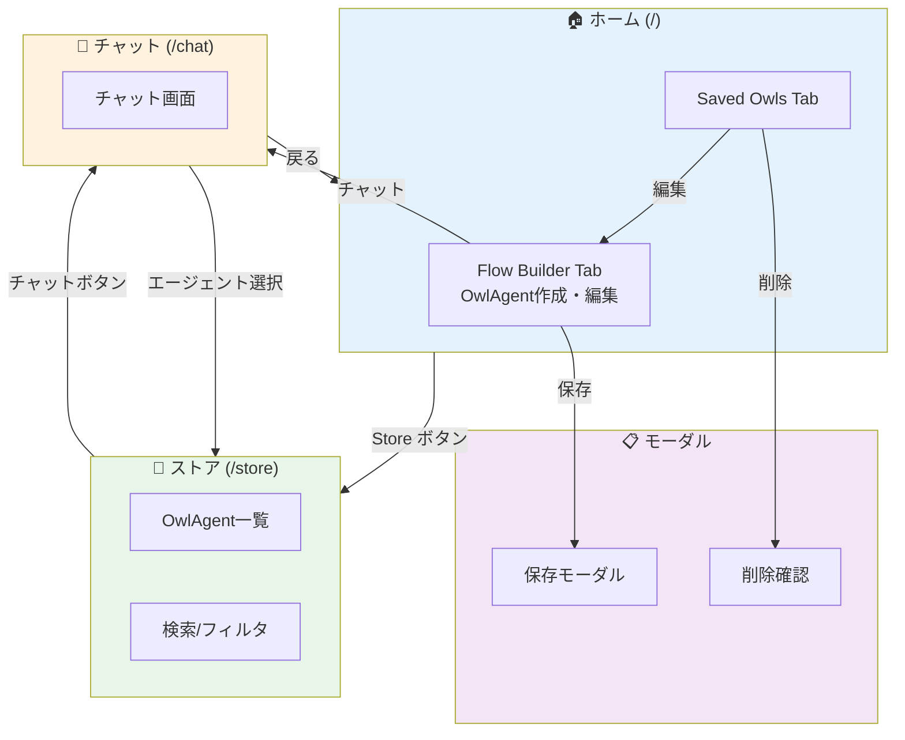

# OwliaFabrica 画面一覧


## 1. 画面構成サマリー

| 区分 | MVP画面数 | Phase 2以降 |
|------|----------|-------------|
| メイン画面 | 4画面 | 2画面 |
| エージェント作成画面 | 2画面（OwlAgentに統合） | 2画面 |
| エージェント利用画面 | 2画面 | 2画面 |
| 管理画面 | 1画面 | 3画面 |
| モーダル/ダイアログ | 1画面 | 3画面 |
| **合計** | **10画面** | **12画面** |

---

## 2. 画面一覧（MVP）

### 2.1 メイン画面

| 画面ID | 画面名 | URL | 概要 | MVP |
|--------|--------|-----|------|-----|
| S-001 | ホーム（統合ナビゲーション） | `/` | タブ切り替えによる統合画面。Flow Builder、Saved Owlsにアクセス | ✅ |
| S-002 | エージェントストア | `/store` | 公開されたOwlAgentの一覧表示・検索・フィルタリング | ✅ |
| S-003 | チャット画面 | `/chat` | OwlAgentとの対話画面 | ✅ |
| S-004 | ダッシュボード | `/dashboard` | 利用状況・統計・KPIの可視化 | - |
| S-005 | ユーザー設定 | `/settings` | ユーザープロファイル・環境設定 | - |

---

### 2.2 エージェント作成画面

| 画面ID | 画面名 | URL/場所 | 概要 | MVP |
|--------|--------|---------|------|-----|
| S-101 | 統合フロービルダー | `/` (Tab: Flow Builder) | OwlAgentの作成・編集。フロー内で他のOwlAgentを参照可能（OwlAgentNodeタイプ） | ✅ |
| S-102 | 保存済みOwl一覧 | `/` (Tab: Saved Owls) | 作成済みOwlAgentの一覧表示・編集・削除 | ✅ |
| S-104 | テンプレートギャラリー | `/templates` | 用途別テンプレート一覧・プレビュー | - |
| S-105 | RAG管理 | `/rag` | RAGコレクションの作成・編集・ファイルアップロード | - |

---

### 2.3 エージェント利用画面

| 画面ID | 画面名 | URL | 概要 | MVP |
|--------|--------|-----|------|-----|
| S-201 | エージェントストア | `/store` | 公開エージェントの検索・カテゴリフィルタ・カード表示 | ✅ |
| S-202 | チャット実行画面 | `/chat?chatflow={id}` | 選択したエージェントとのチャットインターフェース | ✅ |
| S-203 | エージェント詳細 | `/agent/{id}` | エージェントの詳細情報・能力値・使用例・レビュー | - |
| S-204 | マイエージェント | `/my-agents` | お気に入り・利用履歴・カスタマイズ済みエージェント | - |

---

### 2.4 管理画面

| 画面ID | 画面名 | URL | 概要 | MVP |
|--------|--------|-----|------|-----|
| S-301 | 接続ステータス | API経由 | LLM API/RAG/外部APIの接続状態確認 | ✅ |
| S-302 | 利用状況ダッシュボード | `/admin/dashboard` | 全体の利用統計・人気エージェント・エラー率 | - |
| S-303 | 承認ワークフロー | `/admin/approvals` | 全社公開申請のレビュー・承認/却下 | - |
| S-304 | 監査ログ | `/admin/logs` | 操作履歴・セキュリティイベントの確認 | - |

---

### 2.5 モーダル/ダイアログ

| 画面ID | 画面名 | 表示元 | 概要 | MVP |
|--------|--------|-------|------|-----|
| M-001 | エージェント保存モーダル | S-101 | フローをOwlAgentとして保存（名前・説明・タグ設定） | ✅ |
| M-002 | ノード設定パネル | S-101 | ノードのパラメータ設定・実装選択・人間チェック設定 | ✅ |
| M-003 | 人間レビューモーダル | S-101実行時 | AIの出力を人間が確認・承認/拒否/編集 | ✅ |
| M-004 | 削除確認ダイアログ | S-102 | OwlAgent削除の確認 | ✅ |
| M-005 | テスト実行モーダル | S-101 | テスト入力・結果表示・RAGヒット確認 | - |
| M-006 | 公開範囲設定モーダル | S-101 | 自分/チーム/部署/全社の公開範囲選択 | - |
| M-007 | エージェント評価モーダル | S-202 | 👍/👎評価・コメント入力 | - |

---

## 3. 画面詳細

### 3.1 S-001: ホーム（統合ナビゲーション）

```
┌─────────────────────────────────────────────────────────────────────┐
│  [🔧 Flow Builder] [📁 Saved Owls]                         [Store →] │
├─────────────────────────────────────────────────────────────────────┤
│                                                                     │
│                     （選択されたタブのコンテンツ）                    │
│                                                                     │
│                                                                     │
│                                                                     │
│                                                                     │
│                                                                     │
│                                                                     │
└─────────────────────────────────────────────────────────────────────┘
```

**主要機能:**
- タブ切り替えによる2つのモードへのアクセス
  - Flow Builder: OwlAgentの作成・編集（他のOwlAgentをノードとして参照可能）
  - Saved Owls: 保存済みOwlAgent一覧
- Storeへのクイックアクセスボタン

**対応機能:** C-8, C-9, C-10, C-11, C-12, C-13

---

### 3.2 S-101: 統合フロービルダー

```
┌─────────────────────────────────────────────────────────────────────┐
│ OwlAgent フロービルダー                                    [保存]   │
├─────────────────────────────────────────────────────────────────────┤
│ ┌───────────────┐                                                   │
│ │ ノードパレット │  ┌─────────────────────────────────────────────┐ │
│ │               │  │                                             │ │
│ │ [LLM]         │  │              キャンバス領域                  │ │
│ │ [Prompt]      │  │                                             │ │
│ │ [Memory]      │  │    ┌─────┐      ┌─────┐      ┌─────┐       │ │
│ │ [Tool]        │  │    │ LLM │──────│Chain│──────│ Out │       │ │
│ │ [OwlAgent]    │  │    └─────┘      └─────┘      └─────┘       │ │
│ │ ...           │  │                                             │ │
│ │               │  │                                             │ │
│ │ ─────────────  │  │                                             │ │
│ │ 保存済みOwl   │  │                                             │ │
│ │ ┌───────────┐ │  │                                             │ │
│ │ │🦉 FAQ Bot │ │  │                                             │ │
│ │ │🦉 Helper  │ │  │                                             │ │
│ │ └───────────┘ │  └─────────────────────────────────────────────┘ │
│ └───────────────┘                                                   │
└─────────────────────────────────────────────────────────────────────┘
```

**主要機能:**
- ノードのドラッグ&ドロップでフロー作成
- 既存OwlAgentをノードとして配置可能（OwlAgentNodeタイプ）
- エッジでノード間を接続
- フローをOwlAgentとして保存
- チャット画面への遷移

**対応機能:** C-8〜C-21, C-24〜C-28, C-35〜C-37

---

### 3.3 S-102: 保存済みOwl一覧

```
┌─────────────────────────────────────────────────────────────────────┐
│  保存済みフクロウ一覧                              [+ 新規作成]      │
├─────────────────────────────────────────────────────────────────────┤
│                                                                     │
│  ┌─────────────────┐  ┌─────────────────┐  ┌─────────────────┐     │
│  │ 🦉 FAQ Bot      │  │ 🦉 Code Helper  │  │ 🦉 Report Gen   │     │
│  │                 │  │                 │  │                 │     │
│  │ カスタマー対応用 │  │ コードレビュー  │  │ 月次レポート生成│     │
│  │                 │  │                 │  │                 │     │
│  │ [編集] [削除]   │  │ [編集] [削除]   │  │ [編集] [削除]   │     │
│  └─────────────────┘  └─────────────────┘  └─────────────────┘     │
│                                                                     │
└─────────────────────────────────────────────────────────────────────┘
```

**主要機能:**
- 保存済みOwlAgentのカード/リスト表示
- 編集画面への遷移
- 削除（確認ダイアログ付き）
- 新規作成ボタン

**対応機能:** C-12, C-13, C-44

---

### 3.4 S-201: エージェントストア

```
┌─────────────────────────────────────────────────────────────────────┐
│  エージェントストア                                                  │
│  コミュニティが作成した優秀なAIエージェントを探索して利用しましょう  │
├─────────────────────────────────────────────────────────────────────┤
│  [🔍 検索...                    ] [カテゴリー ▼] [並び順 ▼]         │
├─────────────────────────────────────────────────────────────────────┤
│                                                                     │
│  ┌─────────────────┐  ┌─────────────────┐  ┌─────────────────┐     │
│  │ 🦉 FAQ Bot      │  │ 🦉 Code Helper  │  │ 🦉 Report Gen   │     │
│  │                 │  │                 │  │                 │     │
│  │ 社内規程の      │  │ コードレビュー  │  │ 月次レポートを  │     │
│  │ 問い合わせ対応  │  │ 支援            │  │ 自動生成        │     │
│  │                 │  │                 │  │                 │     │
│  │ [ビジネス]      │  │ [プログラミング]│  │ [データ分析]    │     │
│  │                 │  │                 │  │                 │     │
│  │ [詳細] [チャット]│  │ [詳細] [チャット]│  │ [詳細] [チャット]│     │
│  └─────────────────┘  └─────────────────┘  └─────────────────┘     │
│                                                                     │
└─────────────────────────────────────────────────────────────────────┘
```

**主要機能:**
- キーワード検索
- カテゴリーフィルタ（ビジネス、プログラミング、クリエイティブ等）
- ソート（人気順、新着順、評価順、名前順）
- チャット画面への遷移
- エージェント詳細画面への遷移

**対応機能:** C-46〜C-52

---

### 3.6 S-202: チャット実行画面

```
┌─────────────────────────────────────────────────────────────────────┐
│  [←] FAQ Bot                                     [abc123...]         │
│      社内規程の問い合わせに対応するエージェント                       │
├─────────────────────────────────────────────────────────────────────┤
│                                                                     │
│  ┌─────────────────────────────────────────────────────────────┐   │
│  │ 🤖 こんにちは！社内規程についてお答えします。              │   │
│  │    何かご質問はありますか？                                 │   │
│  └─────────────────────────────────────────────────────────────┘   │
│                                                                     │
│  ┌─────────────────────────────────────────────────────────────┐   │
│  │ 👤 休暇の申請方法を教えてください                          │   │
│  └─────────────────────────────────────────────────────────────┘   │
│                                                                     │
│  ┌─────────────────────────────────────────────────────────────┐   │
│  │ 🤖 休暇の申請は以下の手順で行います：                      │   │
│  │    1. 社内ポータルにログイン                               │   │
│  │    2. 「勤怠管理」メニューを選択                           │   │
│  │    3. ...                                                   │   │
│  └─────────────────────────────────────────────────────────────┘   │
│                                                                     │
├─────────────────────────────────────────────────────────────────────┤
│  [メッセージを入力...                                    ] [送信]   │
└─────────────────────────────────────────────────────────────────────┘
```

**主要機能:**
- ストリーミング応答
- 会話履歴の表示
- メッセージ入力・送信
- エージェント情報の表示

**対応機能:** C-56〜C-58

---

### 3.7 M-002: ノード設定パネル

```
┌─────────────────────────────────────┐
│  LLM ノード設定              [×]   │
├─────────────────────────────────────┤
│                                     │
│  ◆ 基本設定                         │
│  ┌─────────────────────────────┐   │
│  │ 実装: [OpenAI GPT-4      ▼] │   │
│  │ モデル: [gpt-4-turbo     ▼] │   │
│  │ Temperature: [0.7        ]  │   │
│  └─────────────────────────────┘   │
│                                     │
│  ◆ プロンプト                       │
│  ┌─────────────────────────────┐   │
│  │ システムプロンプト:          │   │
│  │ [テンプレートから選択 ▼]    │   │
│  │ ┌─────────────────────────┐ │   │
│  │ │あなたは親切な          │ │   │
│  │ │アシスタントです...     │ │   │
│  │ └─────────────────────────┘ │   │
│  └─────────────────────────────┘   │
│                                     │
│  ◆ 人間による確認設定               │
│  ┌─────────────────────────────┐   │
│  │ 確認を有効にする: [ON/OFF]   │   │
│  │ 出力編集を許可: [ON/OFF]     │   │
│  │ 確認メッセージ: [         ]  │   │
│  │ 自動承認: [0] 秒後           │   │
│  └─────────────────────────────┘   │
│                                     │
│              [適用] [キャンセル]    │
└─────────────────────────────────────┘
```

**主要機能:**
- ノード種別ごとのパラメータ設定
- 実装の選択（OpenAI/Claude等）
- プロンプトテンプレートの適用
- 人間チェック機能の設定

**対応機能:** C-17, C-20〜C-23, C-28

---

### 3.8 M-003: 人間レビューモーダル

```
┌─────────────────────────────────────────────────────────────────┐
│  🔍 人間による確認                                       [×]   │
├─────────────────────────────────────────────────────────────────┤
│                                                                 │
│  ノード: LLM Node #3                                           │
│  確認メッセージ: この応答内容を確認してください                 │
│                                                                 │
│  ◆ AIの出力:                                                   │
│  ┌─────────────────────────────────────────────────────────┐   │
│  │ 休暇申請は以下の手順で行えます：                       │   │
│  │                                                         │   │
│  │ 1. 社内ポータルにログインします                        │   │
│  │ 2. 「勤怠管理」→「休暇申請」を選択                     │   │
│  │ 3. 希望日と理由を入力して申請します                    │   │
│  │                                                         │   │
│  │ ※ 申請は上長の承認が必要です                          │   │
│  └─────────────────────────────────────────────────────────┘   │
│                                                                 │
│  ◆ コメント（任意）:                                           │
│  ┌─────────────────────────────────────────────────────────┐   │
│  │                                                         │   │
│  └─────────────────────────────────────────────────────────┘   │
│                                                                 │
│  [❌ 拒否]              [✏️ 編集して承認]              [✅ 承認] │
└─────────────────────────────────────────────────────────────────┘
```

**主要機能:**
- AIの出力内容表示
- 承認/拒否/編集の3アクション
- コメント入力
- 編集モード（出力の修正）

**対応機能:** C-20, C-21

---

## 4. 画面遷移図



---

## 5. 画面 × 機能マトリクス

| 画面 | C-1〜3 | C-8〜13 | C-14〜19 | C-20〜21 | C-35〜37 | C-46〜52 | C-56〜58 |
|------|--------|---------|----------|----------|----------|----------|----------|
| S-001 ホーム | - | ✅ | - | - | - | - | - |
| S-101 統合フロービルダー | ✅ | ✅ | ✅ | ✅ | ✅ | - | - |
| S-102 保存済みOwl | - | ✅ | - | - | - | - | - |
| S-201 ストア | - | - | - | - | - | ✅ | - |
| S-202 チャット | - | - | - | - | - | - | ✅ |
| M-004 削除確認 | - | ✅ | - | - | - | - | - |

---

## 6. コンポーネント対応表

| 画面ID | 主要コンポーネント | ファイルパス |
|--------|------------------|-------------|
| S-001 | Home, TabPanel | `app/page.tsx` |
| S-101 | FlowBuilder | `app/components/FlowBuilder.tsx` |
| S-102 | SavedOwlsList | `app/components/SavedOwlsList.tsx` |
| S-201 | StorePage, AgentStoreCard | `app/store/page.tsx`, `app/components/store/AgentStoreCard.tsx` |
| S-202 | ChatContent | `app/chat/page.tsx` |
| M-001 | SaveAsOwlModal | `app/components/SaveAsOwlModal.tsx` |
| M-002 | NodeConfigPanel | `app/components/NodeConfigPanel.tsx` |

---

## 7. レスポンシブ対応

| 画面 | デスクトップ | タブレット | モバイル |
|------|-------------|-----------|---------|
| S-001 ホーム | ✅ 最適化 | ✅ タブ縮小 | ⚠️ 縦スクロール |
| S-101 統合フロービルダー | ✅ 最適化 | ✅ カード縮小 | ✅ 縦スクロール |
| S-102 保存済みOwl | ✅ グリッド3列 | ✅ グリッド2列 | ✅ グリッド1列 |
| S-201 ストア | ✅ グリッド3列 | ✅ グリッド2列 | ✅ グリッド1列 |
| S-202 チャット | ✅ 最適化 | ✅ 最適化 | ✅ 最適化 |

**凡例:**
- ✅ 最適化済み
- ⚠️ 制限付き対応
- ❌ 非対応（デスクトップ推奨）

---

## 8. アクセシビリティ要件

| 要件 | 対応状況 | 備考 |
|------|---------|------|
| キーボードナビゲーション | 🔶 一部対応 | タブ移動は対応、キャンバス操作は未対応 |
| スクリーンリーダー | 🔶 一部対応 | ARIAラベル追加が必要 |
| コントラスト比 | ✅ 対応 | ダークテーマで4.5:1以上確保 |
| フォーカス表示 | ✅ 対応 | MUIデフォルト対応 |
| 代替テキスト | 🔶 一部対応 | アイコンにaria-label追加が必要 |

---

## 9. Phase 2 以降の画面

| 画面ID | 画面名 | 概要 | 優先度 |
|--------|--------|------|-------|
| S-005 | ダッシュボード | 利用統計・KPI可視化 | 中 |
| S-006 | ユーザー設定 | プロファイル・環境設定 | 低 |
| S-104 | テンプレートギャラリー | 用途別テンプレート | 中 |
| S-105 | RAG管理 | RAGコレクション管理 | 高 |
| S-203 | エージェント詳細 | 詳細情報・レビュー | 中 |
| S-204 | マイエージェント | お気に入り・履歴 | 低 |
| S-302 | 利用状況ダッシュボード | 管理者向け統計 | 中 |
| S-303 | 承認ワークフロー | 公開申請レビュー | 高 |
| S-304 | 監査ログ | 操作履歴確認 | 中 |
| M-005 | テスト実行モーダル | テスト入力・結果 | 高 |
| M-006 | 公開範囲設定モーダル | 公開範囲選択 | 高 |
| M-007 | エージェント評価モーダル | 評価・コメント | 低 |
